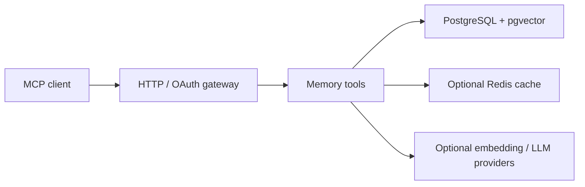
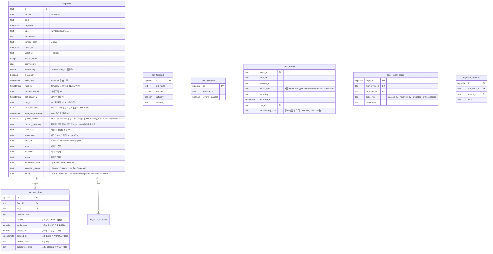
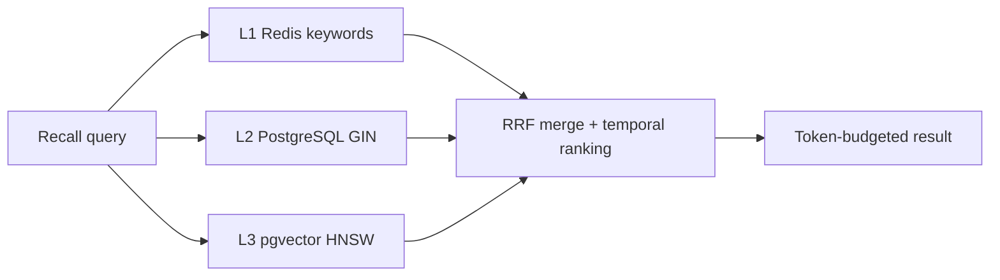
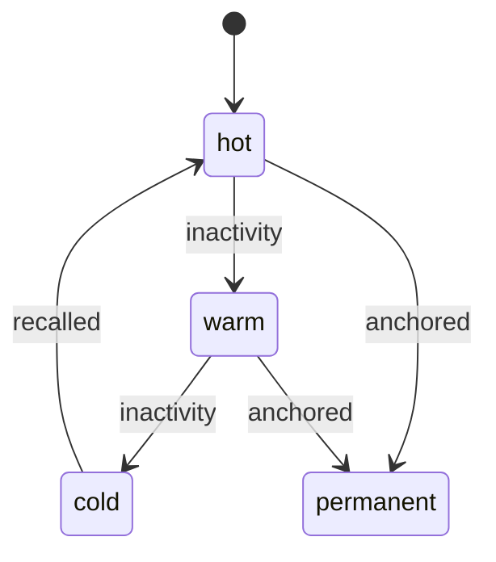

# Architecture

## 시스템 구조



```
server.js  (HTTP 서버)
    │
    ├── POST /mcp          Streamable HTTP — JSON-RPC 수신
    ├── GET  /mcp          Streamable HTTP — SSE 스트림
    ├── DELETE /mcp        Streamable HTTP — 세션 종료
    ├── GET  /sse          Legacy SSE — 세션 생성
    ├── POST /message      Legacy SSE — JSON-RPC 수신
    ├── GET  /health       헬스 체크
    ├── GET  /metrics      Prometheus 메트릭
    ├── GET  /authorize    OAuth 2.0 인가 엔드포인트
    ├── POST /token        OAuth 2.0 토큰 엔드포인트
    ├── GET  /.well-known/oauth-authorization-server
    └── GET  /.well-known/oauth-protected-resource
    │
    ├── lib/jsonrpc.js        JSON-RPC 2.0 파싱 및 메서드 디스패치. `dispatchJsonRpc`는 METHOD_MAP 객체로 메서드명→핸들러를 정적 매핑
    ├── lib/tool-registry.js  18개 기억 도구 등록 및 라우팅
    │
    └── lib/memory/
            ├── MemoryManager.js          비즈니스 로직 조율 facade (259줄, 싱글턴). 15개 공개 메서드를 1줄 위임으로 4개 processor에 라우팅. 공유 프로퍼티는 _installSharedSync로 동기화
            ├── processors/               remember/recall/reflect/link 도메인 처리기 모듈
            │   ├── MemoryRememberer.js   remember() 전담 (~695줄). _runPolicyGate 헬퍼로 dryRun·atomic·non-atomic 분기를 동일 시점에 평가하며, 관련 변수를 사용 전에 선언하여 TDZ(Temporal Dead Zone) 참조 오류를 방지한다
            │   ├── MemoryRecaller.js     recall() 전담 (~405줄). fields pick 단계, depth 필터, CBR 경로
            │   ├── MemoryReflector.js    reflect() 전담 (~89줄). session 요약→파편 변환
            │   ├── MemoryLinker.js       link()/forget()/amend() 전담 (~80줄)
            │   ├── ReflectProcessor.js   reflect() 로직 전담. summary→파편 변환, episode 생성, Working Memory 정리
            │   ├── AutoReflect.js        세션 종료 시 자동 reflect 오케스트레이터
            │   ├── EpisodeContinuityService.js reflect() 호출 후 case_events milestone_reached + preceded_by 엣지 연결 (idempotency_key 기반 중복 방지)
            │   └── SessionActivityTracker.js 세션별 도구 호출/파편 활동 추적 (Redis)
            ├── read/                     검색 레이어 모듈
            │   ├── FragmentSearch.js     3계층 검색 조율 (구조적: L1→L2, 시맨틱: L1→L2‖L3 RRF 병합). `_executeSearch`는 `_buildTextRRF` (text 파라미터 있을 때 L2+L3 병렬 RRF) / `_buildFallbackCombined` (text 없을 때 L1+L2, keywords 존재 시 합성 텍스트 L3 시맨틱 보조를 병렬 결합해 `L3kw:N` 세그먼트로 병합) 두 내부 메서드로 분해
            │   ├── FragmentReader.js     파편 읽기. `getById(id, agentId, keyId, groupKeyIds)` — groupKeyIds 파라미터로 그룹 소속 키의 파편도 단일 호출로 조회. `getByIds`, `getHistory`, `searchByKeywords`, `searchBySemantic`, `findCaseIdBySessionTopic`, `findErrorFragmentsBySessionTopic`
            │   ├── ContextBuilder.js     context() 로직 전담. `build()` 내부에서 `#loadCoreMemory` / `#loadWorkingMemory` / `#loadAnchorMemory` / `#loadLearningFragments` / `#buildInjectionLines` / `#buildStructuredResponse` 6개 비공개 메서드로 분해
            │   ├── GraphNeighborSearch.js L2.5 그래프 이웃 검색 (fragment_links 1-hop 양방향 UNION, tanh 포화 스코어링 + 관계 유형별 부스트)
            │   ├── HistoryReconstructor.js case_id/entity 기반 서사 재구성 (ordered_timeline, causal_chains, unresolved_branches)
            │   ├── Reranker.js           Cross-Encoder 재정렬 (RERANKER_URL 설정 시 외부 HTTP, 미설정 시 ONNX in-process; RERANKER_MODEL로 minilm/bge-m3 선택)
            │   ├── CaseRecall.js         caseMode: true 경로 전담. case_id별 (goal, events[], outcome) 트리플 반환
            │   ├── LinkedFragmentLoader.js 연결 파편 일괄 로드 (1-hop 이웃 배치 조회)
            │   ├── RecallSuggestionEngine.js recall 결과 분석 후 _suggestion 메타 생성
            │   ├── assistant-query.js    보조 조회 헬퍼
            │   ├── SearchScope.js        검색 정합 필터 계약. workspace/caseId/resolutionStatus/phase/affect/keyId 캡슐화. applyTo(fragment) → boolean. L1 HotCache·L2·L3·Graph 각 호출 사이트에서 fragment 단위 필터링을 수행하며 _executeSearch는 별도 후처리 보정을 수행하지 않는다
            │   └── SearchSideEffects.js  검색 부작용 격리 모듈. commitSearchSideEffects()가 searchEventId를 동기 반환하고 SearchParamAdaptor.recordOutcome()을 fire-and-forget으로 호출. FragmentSearch는 검색 파이프라인에만 집중
            ├── write/                    쓰기 레이어 모듈
            │   ├── FragmentWriter.js     파편 쓰기 (insert, update, delete, incrementAccess, touchLinked)
            │   ├── FragmentFactory.js    파편 생성, 유효성 검증, PII 마스킹
            │   ├── FragmentStore.js      PostgreSQL CRUD 파사드 (FragmentReader + FragmentWriter 위임)
            │   ├── RememberPostProcessor.js remember() 후처리 파이프라인 (임베딩/형태소/링크/assertion/시간링크/평가큐/ProactiveRecall 포함)
            │   ├── ConflictResolver.js   충돌 감지, supersede, autoLinkOnRemember(topic 기반 구조적 링킹)
            │   ├── BatchRememberProcessor.js batchRemember() 로직 전담. Phase A(검증)→B(INSERT)→C(후처리) 3단계. `async: true` 파라미터로 비동기 opt-in 가능: 선검증 후 Redis 큐(`weasley_deepmind:batch_remember_queue`)에 job을 적재하고 즉시 반환. Redis 미설정 시 동기 경로 폴백. 워커(BatchRememberWorker)가 기존 INSERT 경로로 소비
            │   └── BatchRememberWorker.js batch_remember 비동기 큐 워커. `weasley_deepmind:batch_remember_queue` Redis 큐 폴링 → BatchRememberProcessor 동기 경로로 실행. `getBatchRememberWorker()` 싱글톤 팩토리. server.js `gracefulShutdown`에서 `stop()` drain 대기로 안전 종료
            ├── link/                     링크 레이어 모듈
            │   ├── ReconsolidationEngine.js fragment_links weight/confidence 동적 갱신 엔진 (reinforce/decay/quarantine/restore/soft_delete + 이력 기록)
            │   ├── GraphLinker.js        임베딩 완료 이벤트 구독 자동 관계 생성 + 소급 링킹 + Hebbian co-retrieval 링킹
            │   ├── LinkStore.js          파편 링크 관리 (fragment_links CRUD + RCA 체인)
            │   ├── SessionLinker.js      세션 파편 통합, 자동 링크, 사이클 감지
            │   ├── TemporalLinker.js     시간 기반 자동 링크 (동일 topic ±24h, weight=max(0.3, 1-hours/24), 최대 5건)
            │   └── ContradictionDetector.js 모순 감지, 대체 관계 감지, 보류 큐 처리
            ├── consolidate/              통합/GC 레이어 모듈
            │   ├── MemoryConsolidator.js 22단계 선언형 유지보수 파이프라인 (stageDefs 배열, TOTAL_STAGES = stageDefs.length). NLI + Gemini 하이브리드
            │   ├── ConsolidatorGC.js     피드백 리포트, stale 파편 수집/정리, 긴 파편 분할, 피드백 기반 보정
            │   ├── FragmentGC.js         파편 만료 삭제, 지수 감쇠, TTL 계층 전환 (permanent parole + EMA 배치 감쇠 포함)
            │   ├── decay.js              지수 감쇠 반감기 상수, 순수 계산 함수, ACT-R EMA 활성화 근사 (`updateEmaActivation`, `computeEmaRankBoost`), EMA 기반 동적 반감기 (`computeDynamicHalfLife`), 나이 가중치 utility score (`computeUtilityScore`)
            │   ├── UtilityBaseline.js    파편 utility baseline 계산 (중복 제거/압축 판단 기준선)
            │   ├── feedbackFactor.js     피드백 기반 보정 계수 계산
            │   ├── split-gate.js         긴 파편 분할 게이트 조건
            │   └── split-metrics.js      분할 결과 메트릭 집계
            ├── embedding/                임베딩 레이어 모듈
            │   ├── EmbeddingWorker.js    Redis 큐 기반 비동기 임베딩 생성 워커 (EventEmitter)
            │   ├── EmbeddingCache.js     쿼리 임베딩 Redis 캐시 (emb:q:{sha256} 키, TTL 1시간, 장애 격리)
            │   ├── MorphemeIndex.js      형태소 기반 L3 폴백 인덱스
            │   └── MorphemeTokenizer.js  로컬 CPU 형태소 분석기. 유니코드 스크립트 런 분할 후 언어별 라우팅: 한글 garu-ko(filterHangulMorphemes 조사·어미·단음절 필터), 영어 natural PorterStemmer, 중국어 @node-rs/jieba, 일본어 kuromoji(enableKuromoji=false 시 생략). MorphemeIndex.tokenize()가 위임하며 기본 경로(WEASLEY_DEEPMIND_MORPHEME_TOKENIZER=local)에서 LLM 서브프로세스를 대체한다. 벤치마크: 1.06ms/call, 상주 RSS +28.9MB.
            ├── signals/                  신호 레이어 모듈
            │   ├── SpreadingActivation.js contextText 기반 비동기 활성화 전파 (ACT-R 모델, keywords GIN seed → 1-hop 그래프 확산, 10분 TTL 캐시)
            │   ├── CaseRewardBackprop.js  case verification 이벤트 → 증거 파편 importance 원자적 역전파. WEASLEY_DEEPMIND_CASE_BACKPROP_ENABLED 환경변수 미설정 시 즉시 반환
            │   ├── NLIClassifier.js       NLI 기반 모순 분류기 (mDeBERTa ONNX, CPU)
            │   ├── MemoryEvaluator.js     비동기 Gemini CLI 품질 평가 워커 (싱글턴)
            │   ├── SearchMetrics.js       L1/L2/L3/total 레이어별 지연 시간 수집 (Redis 원형 버퍼, P50/P90/P99)
            │   ├── SearchEventAnalyzer.js 검색 이벤트 분석, 쿼리 패턴 추적 (SearchEventRecorder로부터 읽음)
            │   ├── SearchEventRecorder.js FragmentSearch.search() 결과 to search_events 테이블 기록
            │   ├── EvaluationMetrics.js   tool_feedback 기반 implicit Precision@5 및 downstream task 성공률 계산
            │   └── SearchParamAdaptor.js  key_id x query_type x hour별 minSimilarity 온라인 학습, 원자적 UPSERT (116줄)
            ├── QuotaChecker.js           API 키 파편 할당량 검사 (fragment_limit 기반)
            ├── FragmentIndex.js          Redis L1 인덱스 관리, getFragmentIndex() 싱글톤 팩토리
            ├── keyScope.js               `keyScopeClause(params, column, { keyId, groupKeyIds })` 공유 헬퍼. key_id 범위 WHERE 절 생성. FragmentReader.getById / findCaseIdBySessionTopic / findErrorFragmentsBySessionTopic / GraphLinker / LinkStore / HistoryReconstructor / reconstruct.js에서 공유 사용
            ├── CaseEventStore.js         semantic milestone 로그 (case_events CRUD, DAG 엣지, 증거 조인)
            ├── memory-schema.sql         PostgreSQL 스키마 정의
            └── migrations/               DB 마이그레이션 SQL 37개 (migration-001 ~ migration-037, schema_migrations 테이블 기준 순차 적용). `scripts/migrate.js`·`scripts/lint-migrations.js`가 이 경로를 사용
```

지원 모듈:

```
lib/
├── config.js          환경변수를 상수로 노출. AUTH_DISABLED(WEASLEY_DEEPMIND_AUTH_DISABLED), OAUTH_TOKEN_TTL_SECONDS, OAUTH_REFRESH_TTL_SECONDS, ENABLE_OPENAPI, SSE_HEARTBEAT_INTERVAL_MS 포함
├── auth.js            Bearer 토큰 검증. `validateAuthentication(req, msg)` — 실제 진입점. `WEASLEY_DEEPMIND_ACCESS_KEY` 미설정 시 로컬 개발용 `WEASLEY_DEEPMIND_AUTH_DISABLED=true`를 명시하지 않는 한 요청을 거부한다. `resolveAuthConfig(accessKey, authDisabled)` — 인증 설정 해석 순수 함수. `buildAuthDecision(accessKey, authDisabled, bearerToken)` — 테스트 대상 순수 함수 (OAuth/DB API 키 검증 제외)
├── oauth.js           OAuth 2.0 PKCE 인가/토큰 처리
├── sessions.js        Streamable/Legacy SSE 세션 생명주기
├── redis.js           ioredis 클라이언트 (Sentinel 지원)
├── gemini.js          Google Gemini API/CLI 클라이언트 (geminiCLIJson, isGeminiCLIAvailable)
├── compression.js     응답 압축 (gzip/deflate)
├── metrics.js         Prometheus 메트릭 수집 (prom-client). 거부 경로 전용 카운터 4종: `weasley_deepmind_auth_denied_total{reason}` (인증 거부), `weasley_deepmind_cors_denied_total{reason}` (CORS 거부), `weasley_deepmind_rbac_denied_total{tool,reason}` (RBAC 거부), `weasley_deepmind_tenant_isolation_blocked_total{component}` (테넌트 격리 차단)
├── logger.js          Winston 로거 (daily rotate). REDACT_PATTERNS 기반 redactor format: Authorization Bearer 토큰, wdm_ API 키, wdm_session 쿠키, OAuth code/refresh_token/access_token 자동 마스킹 (6개 패턴). content 필드 200자 초과 시 head 50 + tail 50 트리밍
├── openapi.js         OpenAPI 3.1.0 스펙 생성기. `ENABLE_OPENAPI=true` 시 `GET /openapi.json` 활성화. 인증 레벨 기반 도구 목록 필터: master key → 전체 경로(Admin REST API 포함), API key → permissions 기반 도구 목록
├── rate-limiter.js    IP 기반 sliding window rate limiter
├── rbac.js            RBAC 권한 검사 (read/write/admin 도구 레벨 권한 적용)
├── http-handlers.js   HTTP 핸들러 re-export 허브 (21줄). 실제 구현은 lib/handlers/ 하위 모듈
├── scheduler.js       주기 작업 스케줄러 (setInterval 작업 관리)
├── scheduler-registry.js 스케줄러 작업 레지스트리 (작업별 성공/실패 추적)
└── utils.js           Origin 검증, JSON 바디 파싱(2MB 상한), SSE 출력

lib/handlers/
├── _common.js         getAllowedOrigin, setWorkerRefs, recordConsolidateRun (공통 유틸리티)
├── health-handler.js  handleHealth, handleMetrics
├── mcp-handler.js     handleMcpPost/Get/Delete (Streamable HTTP). handleMcpPost는 내부적으로 `_resolveExistingSession` / `_createInitializeSession` / `_validateProtocolVersion` / `_dispatchAndRespond` 4개 비공개 함수로 분해된다. `injectSessionContext(msg, ctx)` — tools/call 메시지의 arguments에 서버 제어 컨텍스트(_sessionId, _keyId, _groupKeyIds, _permissions, _defaultWorkspace) 주입. 클라이언트가 전달한 동명 필드는 서버값으로 덮어쓰기하여 위조 차단
├── sse-handler.js     handleLegacySseGet/Post (Legacy SSE)
└── oauth-handler.js   OAuth 5개 엔드포인트 (ServerMetadata, ResourceMetadata, Register, Authorize, Token)

lib/admin/
├── ApiKeyStore.js     API 키 CRUD, 그룹 CRUD, 인증 검증 (SHA-256 해시 저장, 원시 키 단 1회 반환). `getGroupKeyIds(keyId)` — keyId 소속 그룹의 모든 키 ID 배열 반환 (null 입력 시 null 즉시 반환, DB 쿼리 없음)
├── OAuthClientStore.js OAuth 클라이언트 CRUD (client_id/secret 검증, redirect_uri 화이트리스트)
├── admin-auth.js      Admin 인증 라우트 (POST /auth, 세션 쿠키 발급)
├── admin-keys.js      API 키 관리 라우트
├── admin-memory.js    메모리 운영 라우트 (overview, fragments, anomalies, graph)
├── admin-sessions.js  세션 관리 라우트
├── admin-logs.js      로그 조회 라우트
└── admin-export.js    파편 내보내기/가져오기 라우트 (export, import)

assets/admin/
├── index.html         Admin SPA app shell (로그인 폼 + 컨테이너)
├── admin.css          Admin UI 스타일시트
└── admin.js           Admin UI 로직 (7개 내비게이션: 개요, API 키, 그룹, 메모리 운영, 세션, 로그, 지식 그래프)

lib/http/
└── helpers.js         HTTP SSE 스트림 헬퍼 및 요청 파싱 유틸리티

lib/logging/
└── audit.js           감사 로그 및 접근 이력 기록
```

스토리지 어댑터 계층은 `lib/storage/`에 분리되어 있다.

```
lib/storage/
├── index.js         getStorage() 팩토리 싱글톤. WEASLEY_DEEPMIND_STORAGE 환경변수로 어댑터 선택
│                    pgvector(기본) → PgVectorStore / sqlite-vec → SqliteVecStore
│                    알 수 없는 값은 경고 없이 pgvector로 폴백
├── PgVectorStore.js PostgreSQL + pgvector 어댑터. lib/tools/db.js의 getPrimaryPool()과
│                    queryWithAgentVector()를 StorageAdapter 인터페이스에 맞게 위임
│                    engine='pgvector', vectorSupport='native'
└── SqliteVecStore.js SQLite + sqlite-vec 어댑터 (미구현 스텁)
                     engine='sqlite-vec', vectorSupport='extension'
```

StorageAdapter 공통 인터페이스: `query(sql, params)`, `queryAsAgent(agentId, sql, params)`, `transaction(fn)`, `migrate(filePath, opsClass)`, `close()`, `engine`, `vectorSupport`.

기존 lib/tools/db.js 직접 호출 사이트는 향후 getStorage()로 마이그레이션할 예정이다. 현 시점에서 lib/tools/db.js는 primary pool 및 batch pool을 계속 직접 제공한다.

도구 구현은 `lib/tools/`에 분리되어 있다.

```
lib/tools/
├── memory.js    16개 MCP 도구 핸들러
├── reconstruct.js  reconstruct_history, search_traces 도구 핸들러 (Narrative Reconstruction)
├── memory-schemas.js  도구 스키마 정의 (inputSchema)
├── db.js        PostgreSQL 연결 풀, RLS 적용 쿼리 헬퍼 (MCP 미노출). getPrimaryPool(), getBatchPool(), queryWithAgentVector()
├── db-tools.js  MCP DB 도구 핸들러 (db.js에서 분리된 도구별 로직)
├── embedding.js OpenAI 텍스트 임베딩 생성
├── stats.js     접근 통계 수집 및 저장
├── prompts.js   MCP Prompts 정의 (analyze-session, retrieve-relevant-memory 등)
├── resources.js MCP Resources 정의 (memory://stats, memory://topics 등)
└── index.js     도구 핸들러 export
```

CLI 진입점과 서브커맨드는 `bin/` 및 `lib/cli/`에 분리되어 있다.

```
bin/
└── weasley_deepmind.js          CLI 진입점

lib/cli/
├── parseArgs.js        인자 파서
├── serve.js            서버 시작
├── migrate.js          마이그레이션
├── cleanup.js          노이즈 정리
├── backfill.js         임베딩 백필
├── stats.js            통계 조회
├── health.js           연결 진단
├── recall.js           터미널 recall
├── remember.js         터미널 remember
└── inspect.js          파편 상세
```

1회성 유틸리티 스크립트는 `scripts/`에 분리되어 있다.

```
scripts/
├── backfill-embeddings.js                       임베딩 소급 처리 (1회성)
├── normalize-vectors.js                         벡터 L2 정규화 (1회성)
├── migrate.js                                   DB 마이그레이션 러너 (schema_migrations 기반 증분 적용, .env 자동 로드, pgvector 스키마 자동 감지)
├── post-migrate-flexible-embedding-dims.js      임베딩 차원 마이그레이션
└── cleanup-noise.js                             저품질/노이즈 파편 일괄 정리 (1회성)
```

`config/memory.js`는 별도 파일로 분리된 기억 시스템 설정이다. 시간-의미 복합 랭킹 가중치, stale 임계값, 임베딩 워커, 컨텍스트 주입, 페이지네이션, GC 정책을 담는다. `config/validate-memory-config.js`는 서버 시작 시 1회 호출되어 MEMORY_CONFIG의 가중치 합계, 범위, 타입 제약을 런타임 검증한다. 실패 시 프로세스 시작을 중단한다.

---

## MemoryManager Facade 분해

MemoryManager는 259줄의 thin facade이며 비즈니스 로직은 `lib/memory/processors/` 하위 4개 processor로 분리되어 있다.

```
MemoryManager (259줄, facade)
  ├── MemoryRememberer  (~695줄) — remember(), batchRemember()
  ├── MemoryRecaller    (~405줄) — recall(), context()
  ├── MemoryReflector   ( ~89줄) — reflect()
  └── MemoryLinker      ( ~80줄) — link(), forget(), amend()
```

의존 방향: processors → 공용 모듈 (FragmentStore, FragmentSearch 등) / 외부 호출자 → facade → processors.

### _installSharedSync 설계

facade 생성자는 20개 공유 객체(store, index, factory, search, quotaChecker 등)를 초기화한 뒤 4개 processor에 DI 주입한다. 이후 `_installSharedSync()`를 호출하여 facade의 각 공유 프로퍼티 setter를 `Object.defineProperty`로 래핑한다.

```js
// 개념 코드
Object.defineProperty(this, 'store', {
  set(v) { this._store = v; for (const p of this._processors) p.store = v; }
});
```

`mm.store = stubStore` 형태의 테스트 mock 교체 한 줄이 facade와 모든 processor에 자동 전파된다. 테스트 격리와 프로덕션 DI 모두 동일 코드 경로로 처리된다.

---

## Idempotency (migration-034-v2.16.0-bundle)

`fragments` 테이블은 `idempotency_key TEXT NULL` 컬럼과 partial UNIQUE 인덱스 2종을 갖는다.

| 인덱스 | 조건 | 목적 |
|--------|------|------|
| `uq_frag_idem_tenant` | `idempotency_key IS NOT NULL AND key_id IS NOT NULL` | API key 테넌트 내 유일성 |
| `uq_frag_idem_master` | `idempotency_key IS NOT NULL AND key_id IS NULL` | master 테넌트 내 유일성 |

`remember()` 호출 시 `params.idempotencyKey`가 있으면 `FragmentReader.findByIdempotencyKey(key, keyId)`로 기존 파편을 조회한다. 파편이 존재하면 새로 생성하지 않고 기존 id를 반환하며 `idempotent: true` 필드를 포함한다. 파편이 없으면 정상 저장 후 `idempotency_key` 컬럼에 기록한다.

---

## Rate Limit 헤더

`QuotaChecker.getUsage(keyId)`는 API 키별 파편 사용량을 조회한다. 응답 결과는 모듈 레벨 인메모리 Map에 10초 TTL로 캐싱되어 반복 DB 조회를 차단한다 (상한 1000 항목).

HTTP 응답 헤더 주입 지점: `lib/handlers/mcp-handler.js`의 `sendJSON` 호출 직전에 `QuotaChecker.getUsage()` 결과를 읽어 아래 3개 헤더를 설정한다.

```
X-RateLimit-Limit:     <fragment_limit>
X-RateLimit-Remaining: <fragment_limit - used>
X-RateLimit-Resource:  fragments
```

`keyId === null` (master) 또는 `limit === null` (무제한 키)이면 헤더를 생략한다.

---

## 원격 CLI

`lib/cli/_mcpClient.js`는 CLI 서브명령(`recall`, `remember`, `inspect` 등)이 로컬 서버 없이 원격 MCP 엔드포인트에 접속할 수 있도록 한다.

접속 흐름:
1. `initialize` 요청 전송 → `Mcp-Session-Id` 헤더 수신 (세션 생성)
2. 이후 모든 `tools/call` 요청에 동일 `Mcp-Session-Id` 재사용 (세션 재사용)

인증: `Authorization: Bearer <KEY>` 헤더 사용.

CLI 전역 플래그: `--remote <URL>`, `--key <KEY>`. Local-only 명령(serve, migrate, cleanup, backfill, health, update)은 원격 경유를 지원하지 않는다.

---

## SSE Transport 안정성

### Heartbeat Supervision

SSE 스트림은 주기적 heartbeat(`: ping\n\n`)으로 연결 상태를 감시한다.

- `SSE_HEARTBEAT_INTERVAL_MS`(기본 25s) 간격으로 ping 전송
- `res.write()` 반환값으로 backpressure 감지 (false = 커널 버퍼 가득 참)
- 연속 `SSE_MAX_HEARTBEAT_FAILURES`(기본 3)회 실패 시 세션 자동 종료
- 성공 시 failure counter 리셋

### Proxy 호환성

- `X-Accel-Buffering: no` 헤더: nginx reverse proxy의 SSE 응답 버퍼링 방지
- Legacy SSE 핸들러: `res.flushHeaders()` 즉시 헤더 전송

### Socket Tuning

- `keepAliveTimeout=0`, `headersTimeout=0`, `requestTimeout=0`: 서버 레벨 타임아웃 비활성화 (장시간 SSE 연결 보호)
- `socket.setKeepAlive(true, 60000)`: TCP keep-alive 60s idle 타임아웃
- `socket.setNoDelay(true)`: TCP_NODELAY로 패킷 지연 최소화

### sseWrite Atomic Write

`sseWrite(res, event, data)` (`lib/http/helpers.js`):
- `res.destroyed` / `!res.writable` 사전 검사
- event + data를 단일 `res.write()` 호출로 원자적 전송
- boolean 반환 (true=성공, false=실패)

---

## 데이터베이스 스키마

스키마명은 `agent_memory`다. 스키마 파일: `lib/memory/memory-schema.sql`.



### fragments

모든 파편의 저장소. 시스템의 핵심 테이블이다.

| 컬럼 | 타입 | 제약 | 설명 |
|------|------|------|------|
| id | TEXT | PRIMARY KEY | 파편 고유 식별자 |
| content | TEXT | NOT NULL | 기억 내용 본문 (300자 권장, 원자적 1~3문장) |
| topic | TEXT | NOT NULL | 주제 레이블 (예: database, deployment, security) |
| keywords | TEXT[] | NOT NULL DEFAULT '{}' | 검색용 키워드 배열 (GIN 인덱스) |
| type | TEXT | NOT NULL, CHECK | fact / decision / error / preference / procedure / relation |
| importance | REAL | 0.0~1.0 CHECK | 중요도. type별 기본값, MemoryConsolidator에 의해 감쇠 |
| content_hash | TEXT | UNIQUE | SHA 해시 기반 중복 방지 |
| source | TEXT | | 출처 식별자 (세션 ID, 도구명 등) |
| linked_to | TEXT[] | DEFAULT '{}' | 연결 파편 ID 목록 (GIN 인덱스) |
| agent_id | TEXT | NOT NULL DEFAULT 'default' | RLS 격리 기준 에이전트 ID |
| access_count | INTEGER | DEFAULT 0 | 회상 횟수 — utility_score 산정에 반영 |
| accessed_at | TIMESTAMPTZ | | 최근 회상 시각 |
| created_at | TIMESTAMPTZ | DEFAULT NOW() | 생성 시각 |
| ttl_tier | TEXT | CHECK | hot / warm(기본) / cold / permanent |
| estimated_tokens | INTEGER | DEFAULT 0 | cl100k_base 토큰 수 — tokenBudget 계산에 사용 |
| utility_score | REAL | DEFAULT 1.0 | MemoryEvaluator/MemoryConsolidator가 갱신하는 유용성 점수 |
| verified_at | TIMESTAMPTZ | DEFAULT NOW() | 마지막 품질 검증 시각 |
| embedding | vector(1536) | | OpenAI text-embedding-3-small 벡터. 저장 전 L2 정규화(단위 벡터) 적용 |
| is_anchor | BOOLEAN | DEFAULT FALSE | true 시 감쇠, TTL 강등, 만료 삭제 전부 면제 |
| valid_from | TIMESTAMPTZ | DEFAULT NOW() | Temporal 유효 구간 시작. `asOf` 쿼리의 하한 |
| valid_to | TIMESTAMPTZ | | Temporal 유효 구간 종료. NULL이면 현재 유효 파편 |
| superseded_by | TEXT | | 이 파편을 대체한 파편의 ID |
| last_decay_at | TIMESTAMPTZ | | 마지막 감쇠 적용 시각. NULL이면 accessed_at/created_at 기준으로 보정 |
| key_id | TEXT | FK → api_keys.id, ON DELETE SET NULL | API 키 기반 기억 격리. NULL이면 마스터 키(WEASLEY_DEEPMIND_ACCESS_KEY)로 저장된 기억. 값이 있으면 해당 API 키로만 조회 가능 |
| ema_activation | FLOAT | DEFAULT 0.0 | ACT-R 기저 활성화 EMA 근사값. `incrementAccess()` 호출 시 `α * (Δt_sec)^{-0.5} + (1-α) * prev` 수식으로 갱신(α=0.3). L1 fallback 경로에서는 갱신되지 않음(noEma=true). `_computeRankScore()`에서 importance 부스트로 활용 |
| ema_last_updated | TIMESTAMPTZ | | EMA 마지막 갱신 시각. NULL이면 created_at 기준으로 보정 |
| quality_verified | BOOLEAN | DEFAULT NULL | MemoryEvaluator 품질 판정 결과. NULL=미평가, TRUE=keep(검증됨), FALSE=downgrade/discard(부정). permanent 승격 Circuit Breaker에 사용됨 |
| context_summary | TEXT | | 기억이 생긴 맥락/배경 요약 (episode에서 주로 사용) |
| session_id | TEXT | | 파편이 생성된 세션 ID |
| workspace | TEXT | | 워크스페이스 격리 레이블. NULL이면 전역 파편(모든 workspace 검색에서 노출). 값이 있으면 해당 workspace + 전역 파편만 함께 반환됨 |
| case_id | TEXT | | Narrative Reconstruction 케이스 식별자. 동일 장애/작업 맥락으로 묶인 파편을 그룹화 |
| goal | TEXT | | 케이스의 목표 설명 |
| outcome | TEXT | | 케이스의 실제 결과 설명 |
| phase | TEXT | | 케이스의 현재 단계 레이블 |
| resolution_status | TEXT | CHECK | 케이스 해결 상태: open(진행 중) / resolved(해결됨) / wont_fix(미해결 종료) |
| assertion_status | TEXT | CHECK | 파편 주장 신뢰도: observed(기본, 직접 관측) / inferred(추론) / verified(검증됨) / rejected(기각됨) |
| affect | TEXT | CHECK, DEFAULT 'neutral' | 기억 당시의 정서 상태 태그. neutral / frustration / confidence / surprise / doubt / satisfaction |

인덱스 목록: content_hash(UNIQUE), topic(B-tree), type(B-tree), keywords(GIN), importance DESC(B-tree), created_at DESC(B-tree), agent_id(B-tree), linked_to(GIN), (ttl_tier, created_at)(B-tree), source(B-tree), verified_at(B-tree), is_anchor WHERE TRUE(부분 인덱스), valid_from(B-tree), (topic, type) WHERE valid_to IS NULL(부분 인덱스), id WHERE valid_to IS NULL(부분 UNIQUE). `idx_fragments_key_workspace` (key_id, workspace) WHERE valid_to IS NULL (복합 부분 인덱스 — API 키 + workspace 동시 필터 최적화), `idx_fragments_workspace` (workspace) WHERE workspace IS NOT NULL AND valid_to IS NULL (workspace 단독 전체 조회용 부분 인덱스).

HNSW 벡터 인덱스는 `embedding IS NOT NULL` 조건부 인덱스로 생성된다. 파라미터: m=16(이웃 연결 수), ef_construction=128(인덱스 구축 탐색 깊이), 거리 함수 vector_cosine_ops. ef_search=80 (세션 레벨 SET LOCAL 적용). 벡터 검색 실행 직전 `SET LOCAL enable_seqscan = off`, `SET LOCAL enable_bitmapscan = off`, `SET LOCAL hnsw.iterative_scan = relaxed_order`를 세션 단위로 강제하여 HNSW 인덱스 경로를 보장한다 (`lib/tools/db.js` queryWithAgentVector).

### fragment_links

파편 간 관계망을 전담하는 별도 테이블. fragments 테이블의 linked_to 배열과 병행하여 존재한다.

| 컬럼 | 타입 | 설명 |
|------|------|------|
| id | BIGSERIAL PK | 자동 증가 식별자 |
| from_id | TEXT | 출발 파편 (ON DELETE CASCADE) |
| to_id | TEXT | 도착 파편 (ON DELETE CASCADE) |
| relation_type | TEXT | related / caused_by / resolved_by / part_of / contradicts / superseded_by / co_retrieved / temporal |
| weight | REAL | 링크 강도 (float). `co_retrieved` 관계는 공동 회상 시마다 +1 누적. 기본값 1 |
| confidence | NUMERIC(4,3) | 링크 신뢰도 0~1. ReconsolidationEngine이 동적 갱신. 기본값 1.000 |
| decay_rate | NUMERIC(6,5) | 링크 감쇠율. 기본값 0.005 |
| deleted_at | TIMESTAMPTZ | soft-delete 시각. NULL이면 활성 링크 |
| delete_reason | TEXT | 삭제 사유 |
| quarantine_state | TEXT | 격리 상태. soft(격리 중) / released(해제됨) / NULL(정상) |
| created_at | TIMESTAMPTZ | 관계 생성 시각 |

(from_id, to_id) 조합에 UNIQUE 제약이 걸려 있다. 중복 링크는 저장되지 않고 weight가 증가한다. `idx_fragment_links_active` 부분 인덱스(deleted_at IS NULL)로 활성 링크만 효율적으로 조회한다.

`co_retrieved` 링크는 recall 결과에 2개 이상 파편이 반환될 때 `GraphLinker.buildCoRetrievalLinks()`가 비동기로 생성한다. Hebbian 연관 학습 원리에 따라 자주 함께 검색되는 파편 쌍의 weight가 높아진다.

### tool_feedback

도구 유용성 피드백. recall이 의도에 맞는 결과를 반환했는지, 작업 완료에 충분했는지를 기록한다.

| 컬럼 | 타입 | 설명 |
|------|------|------|
| id | BIGSERIAL PK | |
| tool_name | TEXT | 평가 대상 도구명 |
| relevant | BOOLEAN | 결과가 요청 의도와 관련 있었는가 |
| sufficient | BOOLEAN | 결과가 작업 완료에 충분했는가 |
| suggestion | TEXT | 개선 제안 (100자 이내 권장) |
| context | TEXT | 사용 맥락 요약 (50자 이내 권장) |
| session_id | TEXT | 세션 식별자 |
| trigger_type | TEXT | sampled(훅 샘플링) / voluntary(AI 자발적 호출) |
| created_at | TIMESTAMPTZ | |

### task_feedback

세션 단위 작업 효과성. reflect 도구의 task_effectiveness 파라미터로 기록된다.

| 컬럼 | 타입 | 설명 |
|------|------|------|
| id | BIGSERIAL PK | |
| session_id | TEXT | 세션 식별자 |
| overall_success | BOOLEAN | 세션의 주요 작업이 성공적으로 완료되었는가 |
| tool_highlights | TEXT[] | 특히 유용했던 도구와 이유 목록 |
| tool_pain_points | TEXT[] | 불편하거나 개선이 필요한 도구와 이유 목록 |
| created_at | TIMESTAMPTZ | |

### fragment_versions

amend 도구로 파편을 수정할 때마다 이전 버전이 여기에 보존된다. 수정 이력의 감사 추적(audit trail).

| 컬럼 | 타입 | 설명 |
|------|------|------|
| id | BIGSERIAL PK | |
| fragment_id | TEXT | 원본 파편 ID (ON DELETE CASCADE) |
| content | TEXT | 수정 전 내용 |
| topic | TEXT | 수정 전 주제 |
| keywords | TEXT[] | 수정 전 키워드 |
| type | TEXT | 수정 전 유형 |
| importance | REAL | 수정 전 중요도 |
| amended_at | TIMESTAMPTZ | 수정 시각 |
| amended_by | TEXT | 수정한 agent_id |

### case_events

Narrative Reconstruction의 semantic milestone 로그 테이블. 케이스 또는 세션 범위의 주요 이벤트를 시간순으로 기록한다.

| 컬럼 | 타입 | 설명 |
|------|------|------|
| event_id | TEXT | PRIMARY KEY — 이벤트 고유 식별자 |
| case_id | TEXT | 연관 케이스 ID (fragments.case_id와 대응) |
| session_id | TEXT | 이벤트가 발생한 세션 ID |
| event_type | TEXT | milestone_reached / hypothesis_proposed / hypothesis_rejected / decision_committed / error_observed / fix_attempted / verification_passed / verification_failed |
| summary | TEXT | 이벤트 요약 텍스트 |
| occurred_at | TIMESTAMPTZ | 이벤트 발생 시각 |
| key_id | TEXT | API 키 격리 (fragments.key_id와 동일 기준) |
| idempotency_key | TEXT | 중복 삽입 방지 키. NOT NULL인 경우 UNIQUE 제약 적용 |

### case_event_edges

case_events 간의 인과/순서 관계를 표현하는 DAG 엣지 테이블.

| 컬럼 | 타입 | 설명 |
|------|------|------|
| edge_id | BIGSERIAL | PRIMARY KEY |
| from_event_id | TEXT | 출발 이벤트 (ON DELETE CASCADE) |
| to_event_id | TEXT | 도착 이벤트 (ON DELETE CASCADE) |
| edge_type | TEXT | caused_by / resolved_by / preceded_by / contradicts |
| confidence | REAL | 관계 신뢰도 (0.0~1.0) |

### fragment_evidence

파편과 case_events 간의 증거 조인 테이블. 특정 이벤트를 뒷받침하는 파편을 연결한다.

| 컬럼 | 타입 | 설명 |
|------|------|------|
| id | BIGSERIAL | PRIMARY KEY |
| fragment_id | TEXT | 증거 파편 (ON DELETE CASCADE) |
| event_id | TEXT | 연관 이벤트 (ON DELETE CASCADE) |
| kind | TEXT | 증거 역할 분류 레이블 |

### link_reconsolidations

fragment_links의 weight/confidence 변경 이력을 기록하는 감사 테이블. ReconsolidationEngine이 reconsolidate() 호출마다 삽입한다.

| 컬럼 | 타입 | 설명 |
|------|------|------|
| id | BIGSERIAL PK | |
| link_id | BIGINT | 대상 링크 ID (ON DELETE CASCADE) |
| action | TEXT | reinforce / decay / quarantine / restore / soft_delete |
| old_weight | REAL | 변경 전 weight |
| new_weight | REAL | 변경 후 weight |
| old_confidence | NUMERIC(4,3) | 변경 전 confidence |
| new_confidence | NUMERIC(4,3) | 변경 후 confidence |
| reason | TEXT | 변경 사유 |
| triggered_by | TEXT | 트리거 출처 (예: tool_feedback:recall) |
| key_id | TEXT | API 키 격리 |
| metadata | JSONB | 추가 메타데이터 |
| created_at | TIMESTAMPTZ | |

---

### Row-Level Security

fragments 테이블에 RLS가 활성화되어 있다. 정책명은 `fragment_isolation_policy`. 판단 기준은 세션 변수 `app.current_agent_id`다.

```sql
CREATE POLICY fragment_isolation_policy ON agent_memory.fragments
    USING (
        agent_id = current_setting('app.current_agent_id', true)
        OR agent_id = 'default'
        OR current_setting('app.current_agent_id', true) IN ('system', 'admin')
    );
```

에이전트 ID가 일치하는 파편, `default` 에이전트의 파편(공용 데이터), `system`/`admin` 세션(유지보수용)에만 접근이 허용된다. 도구 핸들러는 쿼리 실행 직전 `SET LOCAL app.current_agent_id = $1`로 컨텍스트를 설정한다.

### API 키 기반 기억 격리

`key_id` 컬럼을 통해 API 키 단위의 추가 격리 레이어를 지원한다. 마스터 키(`WEASLEY_DEEPMIND_ACCESS_KEY`)로 접속한 요청이 저장한 파편은 `key_id = NULL`이며 마스터 키로만 조회 가능하다. DB에 발급된 API 키로 접속한 요청이 저장한 파편은 `key_id = <해당 키 ID>`로 기록되며 그 키만 조회할 수 있다.

이 격리 모델은 다중 에이전트 환경에서 키 단위 메모리 파티셔닝을 구현한다. API 키는 Admin SPA(`/v1/internal/model/nothing`)에서 관리하며, 생성 시 원시 키(`wdm_<slug>_<32 hex>`)는 응답에서 단 1회만 반환되고 DB에는 SHA-256 해시만 저장된다.

### workspace 기반 기억 격리

`fragments.workspace` 컬럼을 통해 동일 API 키 내에서도 프로젝트·직종·클라이언트 단위의 추가 격리 레이어를 지원한다.

**NULL = 전역 파편**: `workspace IS NULL`인 파편은 어느 workspace 검색에서도 항상 노출된다. 기존 파편(workspace 미설정)과의 하위 호환성을 보장한다.

**검색 필터**: workspace 지정 시 `(workspace = $X OR workspace IS NULL)` 조건이 적용된다. 해당 workspace 파편과 전역 파편이 함께 반환된다.

**우선순위**: MCP 도구에서 명시적 `workspace` 파라미터 > 키의 `default_workspace` > NULL(전역).

**설정 방법**: Admin SPA의 키 편집 화면에서 `default_workspace`를 설정하거나, `PATCH /v1/internal/model/nothing/keys/:id/workspace`로 변경한다.

**사용 시나리오**:
- 개발자가 여러 프로젝트를 같은 Claude Code 세션에서 전환할 때 (`workspace: "weasley-deepmind"`, `workspace: "docs-mcp"`)
- 동일 에이전트가 업무/개인 기억을 분리할 때 (`workspace: "work"`, `workspace: "personal"`)
- 프리랜서가 클라이언트별 기억을 격리할 때 (`workspace: "client-acme"`, `workspace: "client-xyz"`)

Admin UI(`/v1/internal/model/nothing`)는 마스터 키 인증이 필요하다. Authorization Bearer 헤더로 인증한다. POST /auth 성공 시 HttpOnly 세션 쿠키가 발급되어 이후 요청에 자동 첨부된다.

### OAuth 2.0 인증 흐름

MCP 클라이언트는 RFC 8414/RFC 7591/RFC 7636 기반 OAuth 2.0 흐름으로 연결한다. API 키를 `client_id`로 직접 사용하는 것도 지원된다.

```
1. Discovery
   GET /.well-known/oauth-protected-resource
       → resource_server, authorization_server 메타데이터 반환
   GET /.well-known/oauth-authorization-server
       → authorization_endpoint, token_endpoint, DCR endpoint 반환

2. DCR (Dynamic Client Registration, RFC 7591)
   POST /register
   { client_name, redirect_uris, ... }
   → { client_id, client_secret } 반환 (OAuthClientStore에 저장)

3. Authorization (PKCE, RFC 7636)
   GET /authorize?response_type=code&client_id=...&redirect_uri=...
                  &code_challenge=...&code_challenge_method=S256&state=...
   → trusted redirect_uri인 경우 사용자 승인 없이 자동 승인
   → 승인 시 redirect_uri?code=...&state=... 로 리다이렉트

4. Token
   POST /token  (application/x-www-form-urlencoded)
   grant_type=authorization_code, code=..., code_verifier=...
   → { access_token, refresh_token, expires_in } 반환

   POST /token
   grant_type=refresh_token, refresh_token=...
   → 새 access_token 발급. is_api_key 플래그가 갱신 토큰에 전파됨

5. API 호출
   Authorization: Bearer <access_token>
   → lib/auth.js → validateAuthentication()이 토큰 검증 후 keyId 추출
```

- **API 키를 OAuth client_id로 사용**: `wdm_` 접두사 키를 `client_id`로 전달하면 DCR 없이 직접 authorization_code 흐름 진입 가능
- **세션 자동 복구**: "Session not found" 오류 발생 시 서버가 재인증 후 keyId/groupKeyIds를 보존하여 새 세션을 자동 생성한다
- **구현 파일**: `lib/oauth.js`, `lib/admin/OAuthClientStore.js`

### Tenant Isolation 보안 모델

기억 격리는 세 가지 레이어로 구성된다.

| 레이어 | 격리 기준 | 동작 |
|--------|----------|------|
| RLS (Row-Level Security) | `agent_id` | 세션 변수 `app.current_agent_id` 기준. `default` 에이전트와 `system`/`admin` 세션 공통 접근 허용 |
| key_id 격리 | `key_id` 컬럼 | master key: `key_id = NULL` (전체 접근), API key: `key_id = <해당 키 ID>` (자기 소유 파편만) |
| 그룹 격리 | `groupKeyIds` 배열 | 동일 그룹 소속 키들 간 파편 공유. `COALESCE(group_id, api_keys.id)` 를 effective_key_id로 사용 |

**key_id 격리 원칙**:
- `keyId = null` (master): WHERE 절에 key_id 조건 생략 → 전체 파편 접근
- `keyId = 값` (API key): `AND (key_id = $N OR key_id IN (groupKeyIds))` 조건 추가 → 자기 소유 + 그룹 파편만 접근

**workspace 격리** (동일 key_id 내 추가 파티셔닝):
- `workspace IS NULL`: 전역 파편 (모든 workspace 검색에서 노출)
- `workspace = X`: 해당 workspace + 전역 파편만 반환 (`workspace = $X OR workspace IS NULL` 조건)

### Admin 콘솔 구조

Admin UI는 app shell 아키텍처로 구성된다 (`assets/admin/index.html` + `assets/admin/admin.css` + `assets/admin/admin.js`). 7개 내비게이션 영역으로 나뉜다:

| 영역 | 설명 | 상태 |
|------|------|------|
| 개요 | KPI 카드, 시스템 헬스, 검색 레이어 분석, 최근 활동 | 구현 완료 |
| API 키 | 키 목록/생성/관리, 상태 변경, 사용량 추적 | 구현 완료 |
| 그룹 | 키 그룹 관리, 멤버 할당 | 구현 완료 |
| 메모리 운영 | 파편 검색/필터, 이상 탐지, 검색 관측성 | 구현 완료 |
| 세션 | 세션 목록, 상세 조회, 활동 추적, 수동 reflect, 종료, 만료 정리, 미반영 일괄 reflect | 구현 완료 |
| 로그 | 로그 파일 목록, 내용 조회(역순 tail), 레벨/검색 필터, 통계 | 구현 완료 |
| 지식 그래프 | 파편 관계 시각화 (D3.js force-directed), 토픽 필터, 노드 상세 | 구현 완료 |

각 탭의 화면 구성과 조작 방법은 [관리자 콘솔 사용 안내](admin-console-guide.md)를 참고한다.

`/stats` 응답은 기본 통계 외에 `searchMetrics`, `observability`, `queues`, `healthFlags` 필드를 포함한다.

**Admin UI ESM 구조** (`assets/admin/`):

번들러 없이 브라우저 네이티브 ESM으로 동작한다. `admin.js`는 58줄의 엔트리포인트로 `assets/admin/modules/` 하위 13개 도메인별 모듈을 동적으로 임포트한다.

| 모듈 | 역할 |
|------|------|
| `state.js` | 전역 상태 관리 (현재 탭, 인증 토큰, 데이터 캐시) |
| `api.js` | Admin REST API 호출 추상화 |
| `ui.js` | 공통 UI 유틸리티 (알림, 로딩 스피너, 모달) |
| `format.js` | 날짜/크기/상태 포맷 헬퍼 |
| `auth.js` | 로그인/로그아웃, 세션 쿠키 관리 |
| `layout.js` | 내비게이션, 탭 전환, 사이드바 렌더링 |
| `overview.js` | KPI 카드, 시스템 헬스, 최근 활동 |
| `keys.js` | API 키 목록/생성/편집 (permissions toggle, daily_limit 인라인 편집) |
| `groups.js` | 키 그룹 관리, 멤버 할당 |
| `sessions.js` | 세션 목록/상세/reflect/종료 |
| `graph.js` | D3.js force-directed 지식 그래프 |
| `logs.js` | 로그 파일 조회 (역순 tail, 레벨/검색 필터) |
| `memory.js` | 파편 검색/필터, 이상 탐지, 검색 관측성 |

**Graph 렌더링 최적화** (`modules/graph.js`):

- 시뮬레이션 실행 중 SVG 필터(blur) 비활성화, 안정화(`alphaDecay ≤ 0.05`) 후 복원 — 프레임 드롭 방지
- `adjMap` 사전 구축: 노드 호버 시 이웃 탐색 O(L) → O(1) (L = 총 링크 수)
- 위성 rAF(requestAnimationFrame) 루프: 시뮬레이션 중 정지, `document.hidden` 시 전체 중단 — 백그라운드 탭 CPU 최소화
- `alphaDecay = 0.05` 수렴 가속 (D3 기본값 0.0228 대비 빠른 안정화)

### API 키 그룹

같은 그룹에 속한 API 키들은 동일한 파편 격리 범위를 공유한다. 여러 에이전트(Claude Code, Codex, Gemini 등)가 하나의 프로젝트 기억을 공유할 때 사용한다.

- N:M 매핑: 한 키가 복수 그룹에 소속 가능 (`api_key_group_members` 테이블)
- 격리 해상도: 인증 시 `COALESCE(group_id, api_keys.id)`를 effective_key_id로 사용
- 그룹 미소속 키: 기존 동작 유지 (자체 id로 격리)

Admin REST 엔드포인트:

| Method | Path | 설명 |
|--------|------|------|
| GET | `.../groups` | 그룹 목록 (key_count 포함) |
| POST | `.../groups` | 그룹 생성 (`{ name, description? }`) |
| DELETE | `.../groups/:id` | 그룹 삭제 (멤버십 CASCADE) |
| GET | `.../groups/:id/members` | 그룹 소속 키 목록 |
| POST | `.../groups/:id/members` | 키를 그룹에 추가 (`{ key_id }`) |
| DELETE | `.../groups/:gid/members/:kid` | 키를 그룹에서 제거 |
| GET | `.../memory/overview` | 메모리 전체 현황 (유형/토픽 분포, 품질 미검증, superseded, 최근 활동) |
| GET | `.../memory/search-events?days=N` | 검색 이벤트 분석 (총 검색 수, 실패 쿼리, 피드백 통계) |
| GET | `.../memory/fragments?topic=&type=&key_id=&page=&limit=` | 파편 검색/필터링 (페이지네이션) |
| GET | `.../memory/anomalies` | 이상 탐지 결과 조회 |
| GET | `.../sessions` | 세션 목록 (활동 enrichment, 미반영 세션 수 포함) |
| GET | `.../sessions/:id` | 세션 상세 (검색 이벤트, 도구 피드백 포함) |
| POST | `.../sessions/:id/reflect` | 수동 reflect 실행 |
| DELETE | `.../sessions/:id` | 세션 종료 |
| POST | `.../sessions/cleanup` | 만료 세션 정리 |
| POST | `.../sessions/reflect-all` | 미반영 세션 일괄 reflect |
| GET | `.../logs/files` | 로그 파일 목록 (크기 포함) |
| GET | `.../logs/read?file=&tail=&level=&search=` | 로그 내용 조회 (역순 tail, 레벨/검색 필터) |
| GET | `.../logs/stats` | 로그 통계 (레벨별 카운트, 최근 에러, 디스크 사용량) |
| GET | `.../assets/*` | Admin 정적 파일 서빙 (admin.css, admin.js). 인증 불필요 |

---

## 3계층 검색

recall 도구는 비용이 낮은 계층부터 순서대로 검색한다. 앞 계층에서 충분한 결과가 나오면 뒤 계층은 실행하지 않는다.



**L1: Redis Set 교집합.** 파편이 저장될 때마다 FragmentIndex가 각 키워드를 Redis Set의 키로 사용하여 파편 ID를 저장한다. `keywords:database`라는 Set에는 database를 키워드로 가진 모든 파편의 ID가 들어 있다. 다중 키워드 검색은 여러 Set의 SINTER 연산이다. 교집합 연산의 시간 복잡도는 O(N·K), N은 가장 작은 Set의 크기, K는 키워드 수다. Redis가 인메모리로 처리하므로 수 밀리초 안에 완료된다. L1 결과는 이후 단계에서 L2 결과와 병합된다.

**L2: PostgreSQL GIN 인덱스.** L1 실행 후 항상 실행된다. keywords TEXT[] 컬럼에 GIN(Generalized Inverted Index) 인덱스가 걸려 있다. 검색은 `keywords && ARRAY[...]` 연산자로 수행한다 — 배열 간 교집합 존재 여부를 묻는 연산자다. GIN 인덱스는 배열의 각 원소를 개별적으로 인덱싱하므로 이 연산이 인덱스 스캔으로 처리된다. 순차 스캔이 아니다.

**L2.5: Graph 이웃 확장.** L2 상위 5개 파편의 1-hop 이웃을 fragment_links에서 수집한다. GraphNeighborSearch가 담당하며 RRF 병합 시 가중치 1.5x가 적용된다. 그래프 이웃은 L2 결과가 존재할 때만 실행되므로 추가 비용은 단일 SQL 조회 1회다.

**L3: pgvector HNSW 코사인 유사도.** recall 파라미터에 `text` 필드가 있을 때만 발동한다. 결과 수 부족만으로는 L3가 활성화되지 않는다. 쿼리 텍스트를 임베딩 벡터로 변환하여 `embedding <=> $1` 연산자로 코사인 거리를 계산한다. EmbeddingCache가 Redis에 쿼리 임베딩을 캐싱(키: `emb:q:{sha256 앞 16자}`, TTL 1시간)하므로 동일 쿼리 반복 시 임베딩 API 호출을 건너뛴다. 캐시 장애 시 원본 API로 폴백한다. 모든 임베딩은 L2 정규화된 단위 벡터이므로 코사인 유사도와 내적이 동치다. HNSW 인덱스가 근사 최근접 이웃을 빠르게 찾는다. `threshold` 파라미터로 유사도 하한을 지정할 수 있다 — 이 값 미만의 L3 결과는 결과에서 제외된다. L1/L2 경유 결과는 similarity 값이 없으므로 threshold 필터링에서 제외된다.

모든 계층의 결과는 최종 단계에서 `valid_to IS NULL` 필터를 통과한다 — superseded_by로 대체된 파편은 기본적으로 검색에서 제외된다. `includeSuperseded: true`를 전달하면 만료된 파편도 포함된다.

Redis와 임베딩 API는 선택 사항이다. 없으면 해당 계층 없이 작동한다. PostgreSQL만으로도 L2 검색과 기본 기능은 완전히 동작한다.

**RRF 하이브리드 병합.** `text` 파라미터가 있을 때 L2와 L3는 `Promise.all`로 병렬 실행된다. 결과는 Reciprocal Rank Fusion(RRF)으로 병합된다: `score(f) = Σ w/(k + rank + 1)`, 기본값 k=60. L1 결과는 l1WeightFactor(기본 2.0)를 곱하여 최우선으로 주입된다. L1에만 있고 content 필드가 없는 파편(내용 미로드)은 최종 결과에서 제외된다. `text` 파라미터 없이 keywords/topic/type만 사용하면 L3 없이 L1+L2 결과만으로 응답한다.

세 계층의 결과가 RRF로 병합된 뒤 시간-의미 복합 랭킹이 적용된다. 복합 점수 공식: `score = effectiveImportance × 0.4 + temporalProximity × 0.3 + similarity × 0.3`. effectiveImportance는 `importance + computeEmaRankBoost(ema_activation) × 0.5`로 계산된다 — ACT-R EMA 활성화 값이 높을수록 자주 회상된 파편의 랭킹이 추가로 부스트된다. `computeEmaRankBoost(ema) = 0.2 × (1 - e^{-ema})`이며 최대 부스트는 0.10이다. 상한을 0.3→0.2로 제한한 이유: importance=0.65 파편의 effectiveImportance가 최대 0.65+0.10×0.5=0.70으로 permanent 승격 기준(importance≥0.8)에 미달, 가비지 파편의 등급 상향 순환을 차단한다. temporalProximity는 anchorTime(기본: 현재 시각) 기준 지수 감쇠로 계산된다 — `Math.pow(2, -distDays / 30)`. anchorTime이 과거 시점이면 그 시점에 가까운 파편이 높은 점수를 받는다. `asOf` 파라미터를 전달하면 자동으로 anchorTime으로 변환되어 일반 recall 경로에서 처리된다. 최종 반환량은 `tokenBudget` 파라미터로 제어된다. js-tiktoken cl100k_base 인코더로 파편마다 토큰을 정확히 계산하여 예산 초과 시 잘라낸다. 기본 토큰 예산은 1000이다. `pageSize`와 `cursor` 파라미터로 결과를 페이지네이션할 수 있다.

recall에 `includeLinks: true`(기본값)가 설정되어 있으면 결과 파편들의 연결 파편을 1-hop 추가 조회한다. `linkRelationType` 파라미터로 특정 관계 유형만 포함할 수 있다 — 미지정 시 caused_by, resolved_by, related가 포함된다. 연결 파편 조회 한도는 `MEMORY_CONFIG.linkedFragmentLimit`(기본 10)이다.

**MemoryRecaller 최종 정렬 (`computeRecallScore`).** FragmentSearch가 반환한 결과에 includeLinks 파편이 합류한 직후, `MemoryRecaller.recall`이 통합 정렬을 한 번 더 수행한다. 단순 복합 점수 재정렬은 cross-encoder reranker 결과를 폐기하므로 다음 4원칙을 따른다. (1) `rerankerScore`가 있으면 그것을 base로 보존한다. (2) 없으면 `effectiveImportance × 0.4 + temporalProximity × 0.3 + similarity × 0.3`에 `unrerankedBaseDiscount`(0.85)를 곱해 reranking 미검증 페널티를 부여한다. (3) `lexicalMatchScore`(topic exact +4, kw in topic +2, kw in keywords +1.5, kw in content +1, 다중 결합 +2)를 log 스케일로 정규화한 뒤 제한 가중치(`lexicalWeightReranked` 0.12 / `lexicalWeightFallback` 0.18)로 가산한다. `lexWeight`는 집합 단위가 아닌 파편별 `rerankerScore` 유무로 분기한다. (4) includeLinks로 추가된 파편은 정렬 직전에 `_source="linked"`로 태깅되어 `lexicalLinkedMultiplier`(0.5)로 lexical 가중치가 절반으로 감쇠된 뒤, 정렬 직후 응답에서 제거된다. 이 설계는 `if (lexical > 0) return 1000 + lexical` 같은 hard override를 의도적으로 피해 cross-encoder 결과 폐기·이중 계산·페이지네이션 불안정을 막는다.

> **참고:** L1 Redis 인덱스는 현재 API 키(keyId) 기반 네임스페이스만 지원한다. agentId 기반 격리는 L2/L3에서 적용되므로 최종 결과 정확도에는 영향 없으나, multi-agent 운영 시 L1 후보 집합에 다른 에이전트 파편이 포함될 수 있다.

---

## TTL 계층

파편은 사용 빈도에 따라 hot, warm, cold, permanent 네 개의 티어를 이동한다. MemoryConsolidator가 주기적으로 강등/승격을 처리한다. 다시 참조되면 hot으로 복귀한다.



| Tier | 설명 |
|------|------|
| hot | 최근 생성되었거나 접근 빈도가 높은 파편 |
| warm | 기본 계층. 대부분의 장기 기억이 여기 있다 |
| cold | 오랫동안 접근되지 않은 파편. 다음 유지보수 사이클의 삭제 후보 |
| permanent | 감쇠, TTL 강등, 만료 삭제 전부 면제 |

`scope: "session"`으로 저장된 파편은 세션 워킹 메모리에 해당한다. 세션 종료 시 소멸한다. `scope: "permanent"`는 기본값이다.

`isAnchor: true`로 표시된 파편은 어느 계층에 있든 MemoryConsolidator의 감쇠 및 삭제 대상에서 영구적으로 제외된다. 중요도가 0.1이더라도 삭제되지 않는다. 절대 잃어서는 안 되는 지식에 사용한다.

stale 기준(일): procedure=30, fact=60, decision=90, default=60. `config/memory.js`의 `MEMORY_CONFIG.staleThresholds`에서 조정한다.

---

## Case-Based Reasoning 엔진

case_id로 파편을 묶어 과거 유사 사례를 구조화 검색하고 인과 체인을 추적하는 서사 재구성 엔진이다.

### CaseEventStore

`lib/memory/CaseEventStore.js`. case_events 테이블의 CRUD와 DAG 엣지/증거 조인을 전담한다.

**event_type 8종**:

| event_type | 설명 |
|------------|------|
| `milestone_reached` | 작업의 주요 완료 단계 도달 |
| `hypothesis_proposed` | 가설 제안 |
| `hypothesis_rejected` | 가설 기각 |
| `decision_committed` | 아키텍처/기술 결정 확정 |
| `error_observed` | 에러 관측 기록 |
| `fix_attempted` | 수정 시도 |
| `verification_passed` | 검증 통과 (→ CaseRewardBackprop 역전파 +0.15) |
| `verification_failed` | 검증 실패 (→ CaseRewardBackprop 역전파 -0.10) |

**주요 메서드**:
- `append(event)`: 이벤트 삽입. `idempotency_key` 기반 중복 방지
- `addEdge(fromId, toId, edgeType, confidence)`: DAG 엣지 추가
- `addEvidence(fragmentId, eventId, kind)`: 파편-이벤트 증거 연결
- `getByCase(caseId)`: 케이스의 전체 이벤트 시간순 조회
- `getBySession(sessionId)`: 세션 범위 이벤트 조회
- `getEdgesByEvents(eventIds)`: 이벤트 ID 목록의 DAG 엣지 일괄 조회

### case_event_edges DAG

`case_event_edges` 테이블은 이벤트 간 인과/순서 관계를 표현하는 방향 비순환 그래프(DAG)다.

| edge_type | 의미 |
|-----------|------|
| `caused_by` | A가 B에 의해 발생함 (근본 원인 추적) |
| `resolved_by` | A가 B에 의해 해결됨 |
| `preceded_by` | A가 B 이전에 발생함 (시간 순서) |
| `contradicts` | A와 B가 서로 모순됨 |

`reconstruct_history` 도구가 BFS로 이 DAG를 탐색하여 인과 체인(`causal_chains`)과 미해결 브랜치(`unresolved_branches`)를 반환한다.

### fragment_evidence

파편과 케이스 이벤트를 연결하는 증거 조인 테이블. `fragment_id + event_id + kind` 트리플로 "어떤 파편이 어떤 이벤트의 증거인가"를 명시한다. `CaseRewardBackprop`이 이 테이블을 조회하여 역전파 대상 파편을 특정한다.

### CaseRecall

recall 도구에 `caseMode: true`를 전달하면 CaseRecall 경로가 활성화된다. case_id별로 `(goal, events[], outcome)` 트리플을 반환하여 유사 사례의 전체 해결 흐름을 한 번에 복원한다.

### CaseRewardBackprop

`lib/memory/signals/CaseRewardBackprop.js`. case_events에 `verification_passed` 또는 `verification_failed` 이벤트가 삽입될 때 fragment_evidence를 통해 증거 파편의 importance를 원자적으로 역전파한다. `WEASLEY_DEEPMIND_CASE_BACKPROP_ENABLED` 환경변수가 `"true"`가 아니면 호출 즉시 반환된다.

- `verification_passed` → 증거 파편 `importance += 0.15` (상한 1.0 클램프)
- `verification_failed` → 증거 파편 `importance -= 0.10` (하한 0.0 클램프)
- PostgreSQL UPDATE … RETURNING으로 단일 쿼리 원자 갱신

---

## Reconsolidation 엔진

tool_feedback 피드백 신호를 fragment_links의 weight/confidence에 실시간 반영하는 링크 강도 갱신 엔진이다.

`lib/memory/link/ReconsolidationEngine.js` + `link_reconsolidations` 테이블.

환경변수 `ENABLE_RECONSOLIDATION=true` 설정 시 활성화된다.

### link_reconsolidations 테이블

weight/confidence 변경 이력 감사 테이블. `ReconsolidationEngine.reconsolidate()` 호출마다 이전값/이후값/사유/트리거 출처를 삽입하여 링크 강도 변화를 추적 가능하게 한다.

### 3가지 액션

| 액션 | 동작 |
|------|------|
| `reinforce` | `weight += delta`, `confidence = min(1, confidence + 0.05)`. 유용하다고 평가된 링크 강화 |
| `decay` | `weight = max(0, weight - delta)`, `confidence = max(0, confidence - 0.03)`. 무관하다고 평가된 링크 약화 |
| `quarantine` | `quarantine_state = 'soft'`. 모순 링크 격리 (검색 결과에서 제외) |

`restore` (격리 해제) 및 `soft_delete` (weight=0 soft-delete) 액션도 지원된다.

### tool_feedback 연동

`tool_feedback` 테이블에 새 피드백이 삽입될 때:
- `relevant = false` → 해당 세션에서 반환된 파편 쌍의 링크에 `decay` 적용
- `relevant = true` → 동일 파편 쌍의 링크에 `reinforce` 적용

이 흐름이 Hebbian 원리에 따른 자기 지도 링크 조정을 구현한다.

---

## Spreading Activation

recall 호출 시 `contextText` 파라미터를 전달하면 관련 파편의 `ema_activation`을 선제적으로 부스트하는 비동기 활성화 전파 엔진이다.

`lib/memory/signals/SpreadingActivation.js`.

환경변수 `ENABLE_SPREADING_ACTIVATION=true` 설정 시 활성화된다.

**동작 흐름**:

1. `contextText`에서 키워드를 추출하여 fragments.keywords GIN 인덱스로 시드 파편(seed) 선별
2. seed 파편의 1-hop 이웃을 `fragment_links`에서 수집 (그래프 확산)
3. 대상 파편의 `ema_activation`에 활성화 점수를 ACT-R 모델에 따라 누적 갱신
4. 결과를 10분 TTL Redis 캐시에 저장하여 동일 맥락 반복 호출 최적화

활성화된 파편은 검색 결과 랭킹 시 `computeEmaRankBoost()`를 통해 importance 부스트를 받아 맥락 연관성 높은 결과가 상위에 배치된다.

---

## Symbolic Memory Layer (opt-in)

확률론적 검색 파이프라인 위에 얹은 검증·해설 계층. 기본 전면 비활성. 기존 컴포넌트 대체 없음.

### 원칙

- 검증만 담당. FragmentSearch/RRF/Reranker/SpreadingActivation 경로는 불변
- 모든 플래그 기본 false → 기본값 상태에서 기존 확률론적 경로 동작 바이트 단위 동일
- Fail-open: detector 오류는 swallow, SymbolicOrchestrator timeout(50ms) 초과 시 fallback
- Tenant isolation: SessionLinker.wouldCreateCycle 포함 14건 전수 커버

### Hook Chain (FragmentSearch.search 라인 88 이후)

```
probabilistic result
    │
    ├── shadow hook (observeLatency 기록만)
    │
    ├── explain hook (ExplanationBuilder.annotate)
    │       └── 6 reason codes: direct_keyword_match / semantic_similarity
    │           / graph_neighbor_1hop / temporal_proximity
    │           / case_cohort_member / recent_activity_ema
    │
    ├── cbr filter (CbrEligibility 4 제약)
    │       └── tenant_match / has_case_id / not_quarantine / resolved_state
    │
    └── annotated result → caller
```

### 9 Core Modules + 5 Rule Files

| 모듈 | 역할 |
|------|------|
| SymbolicOrchestrator | rule_version / correlation_id / timeout / fallback 관리 |
| SymbolicMetrics | prom-client 4종 (claim/warning/gate_blocked/latency) |
| ClaimExtractor | 형태소 기반 polarity claim 추출 |
| ClaimStore | TEXT key_id + `IS NOT DISTINCT FROM` 격리 |
| ClaimConflictDetector | polarity 충돌 + severity heuristic |
| LinkIntegrityChecker | cycle 탐지 (sessionLinker.wouldCreateCycle 재사용) |
| ExplanationBuilder | 6 reason codes annotate (불변 복사) |
| PolicyRules | 5 predicate soft gating |
| CbrEligibility | 4 제약 CBR 필터 |

Rule files (`lib/symbolic/rules/v1/`): `explain.js`, `link-integrity.js`, `claim-conflict.js`, `policy.js`, `proactive-gate.js`

### Storage Schema

**migration-032: fragment_claims**
- `fragment_id TEXT REFERENCES fragments(id)`
- `key_id TEXT` (migration-031 content-hash 패턴과 동일 구조)
- `rule_version TEXT`
- `polarity TEXT`, `subject TEXT`, `predicate TEXT`
- `validation_warnings JSONB`
- Partial unique 2개: `(fragment_id) WHERE key_id IS NULL` / `(fragment_id, key_id) WHERE key_id IS NOT NULL`

**migration-033: api_keys.symbolic_hard_gate**
- `BOOLEAN DEFAULT false`
- 키 단위 opt-in으로 soft → hard gate 전환

### Observability

Prometheus 메트릭 4종 (label: `rule`, `phase`):
- `weasley_deepmind_symbolic_claim_extracted_total` — ClaimExtractor 추출 건수
- `weasley_deepmind_symbolic_warning_total` — advisory warning 생성 건수
- `weasley_deepmind_symbolic_gate_blocked_total{phase}` — phase별 block 건수 (phase=cbr|proactive 등)
- `weasley_deepmind_symbolic_op_latency_ms` — orchestrator 호출 latency histogram

### 단계적 활성화

CHANGELOG.md Migration Guide 참조.

### Tenant Isolation

SessionLinker.wouldCreateCycle의 tenant isolation 사각지대가 봉인되어 있다. `store.isReachable` 4-arg 시그니처로 확장, 호출부 4곳(`autoLinkSessionFragments`, `ReflectProcessor`, `MemoryManager._autoLinkSessionFragments`, `_wouldCreateCycle`) 전수 전파. 회귀 가드: `tests/unit/tenant-isolation.test.js` 6건.

---

## 추가 컴포넌트

### ModeRegistry

`lib/memory/ModeRegistry.js`. Mode preset JSON을 로드하여 세션별 도구 필터와 skill_guide_override를 적용한다.

- preset 정의 파일: `config/modes/*.json` (recall-only, write-only, onboarding, audit)
- `X-Weasley DeepMind-Mode` 헤더 또는 `initialize.params.mode`에서 preset 이름을 읽음
- `api_keys.default_mode` 컬럼(migration-034)으로 키 단위 기본값 설정 가능
- tools/list 응답을 preset에 따라 필터링하여 허용 도구만 노출

```
요청 헤더/params.mode
    │
    ▼
ModeRegistry.resolve(mode)
    │
    ├── tools/list 필터 (허용 도구 목록 반환)
    └── get_skill_guide override (onboarding 모드 시 첫 섹션 강제 지정)
```

### RecallSuggestionEngine

`lib/memory/read/RecallSuggestionEngine.js`. recall 호출 결과를 분석하여 `_suggestion` 메타 필드를 생성한다.

- SearchEventRecorder가 기록한 search_events 테이블을 재활용
- fail-open 설계: 엔진 내부 오류 시 `_suggestion: null`로 폴백하여 주 검색 경로에 영향 없음
- 4개 감지 규칙: `repeat_query`, `empty_result_no_context`, `large_limit_no_budget`, `no_type_filter_noisy`
- `_suggestion` 객체: `{code, message, recommendedTool, recommendedArgs}` 또는 null

### LocalTransformersEmbedder

`lib/embeddings/LocalTransformersEmbedder.js`. `@huggingface/transformers` 라이브러리를 사용하는 로컬 임베딩 생성기. `getLocalEmbedder(modelId, dimensions)` 팩토리가 modelId별 싱글톤 인스턴스를 반환한다.

- `EMBEDDING_PROVIDER=transformers` 환경변수로 활성화
- 기본 모델: `Xenova/multilingual-e5-small` (384차원, Q8 quantized, ~60MB)
- 대안 모델: `Xenova/bge-m3` (1024차원, ~280MB, 다국어 고정밀)
- `init()`: 파이프라인 로드 진행 중(in-flight) 호출은 동일 `_initPromise`를 공유해 중복 로드를 막는다. 로드 완료 후 `_pipeline`이 캐시되어 이후 호출은 즉시 반환한다
- `_enqueue(job)`: ONNX 파이프라인이 단일 인스턴스이므로 `embed`/`embedBatch` 추론 요청을 FIFO 체인으로 직렬화한다. 개별 작업 실패가 체인을 끊지 않도록 대기 자체의 에러는 삼키고 호출자에게는 원래 결과만 전달한다
- `embedBatch(texts)`: 배열 입력을 파이프라인에 1회 추론으로 전달한다. 출력이 `tolist()`를 지원하면 이를 사용하고, 미지원 시 `_chunkFlat`으로 평탄 배열을 텍스트 수만큼 균등 분할하는 폴백 경로를 탄다
- 차원 불일치 시 `_assertDims`가 즉시 예외를 던진다
- OpenAI/Gemini 등 API 기반 provider와 상호 배타. 전환 시 DB 스키마 `scripts/post-migrate-flexible-embedding-dims.js` + 임베딩 백필 필수

```
EMBEDDING_PROVIDER=transformers
    │
    ▼
LocalTransformersEmbedder.embed(text) / embedBatch(texts)
    ├── init() — pipeline('feature-extraction', modelId, {dtype:'q8'}) 싱글톤 캐시, in-flight 호출 단일화
    ├── _enqueue(job) — FIFO 직렬화 큐
    ├── mean pooling + normalize (단건) / 배열 1회 추론 + tolist 폴백 (배치)
    └── L2 normalize → number[] / number[][] 변환
```

`lib/tools/embedding.js`의 `generateBatchEmbeddings`는 transformers provider 사용 시 `batchSize` 단위 청크로 `embedBatch`를 호출한다.

상세 전환 절차: [docs/embedding-local.md](embedding-local.md)

### LLM Dispatcher — dispatchChain 및 CLI Providers

`lib/llm/index.js`는 `dispatchChain(chain, prompt, options, deps)` 함수를 분리 export한다. `llmJson()`은 chain 빌드와 `redactPrompt()` 처리를 수행한 뒤 이 함수에 위임한다.

```
llmJson(prompt, options)
    │
    ├── redactPrompt(prompt) → safePrompt
    ├── buildChain(LLM_PRIMARY, LLM_FALLBACKS) → chain
    └── dispatchChain(chain, safePrompt, options, { startedAt })
            │
            ├── provider 순차 시도 (semaphore + circuit breaker 포함)
            └── 첫 성공 응답 반환 / 전부 실패 시 Error throw
```

기존 호출자(AutoReflect, ConsolidatorGC, ContradictionDetector, MemoryEvaluator)는 `llmJson`을 그대로 사용하며 코드 변경 없이 동작한다. MorphemeIndex는 기본 경로(`WEASLEY_DEEPMIND_MORPHEME_TOKENIZER=local`)에서 LLM chain을 호출하지 않고 MorphemeTokenizer 로컬 분석기를 사용한다. `WEASLEY_DEEPMIND_MORPHEME_TOKENIZER=llm` 설정 시에만 `_tokenizeViaLLM()`을 통해 chain을 호출한다.

`codex-cli` provider는 `model` / `timeoutMs` 설정을 실제 CLI 호출까지 전달한다. `qwen-cli` provider도 지원된다.

```
LLM_PRIMARY=gemini-cli
    │
    ▼
[gemini-cli] → 실패 → [anthropic] → 실패 → [codex-cli] → 실패 → [copilot-cli] → 실패 → [qwen-cli] → ...
```

**codex-cli provider** (`lib/llm/providers/CodexCliProvider.js`):
1. `runCodexCLI(stdinContent, prompt, options)` — `codex exec --skip-git-repo-check --sandbox read-only --output-last-message FILE` 실행
2. 요청 옵션이 비어 있으면 provider config의 `model`, `timeoutMs`를 fallback으로 사용
3. 결과 파일 읽기 → JSON 파싱 → 응답 반환
- 환경변수 `OPENAI_API_KEY` 또는 Codex CLI 자체 설정 파일로 인증

**copilot-cli provider** (`lib/llm/providers/CopilotCliProvider.js`):
- GitHub Copilot CLI(`gh copilot suggest`)를 래퍼로 호출
- `extractJsonBlock()` 유틸리티로 응답 말미의 통계/배너 텍스트 제거 후 JSON 추출

**qwen-cli provider** (`lib/llm/providers/QwenCliProvider.js`):
- Alibaba Cloud Qwen Code CLI(`qwen`)를 래퍼로 호출
- `--output-format text` 모드로 실행 후 JSON 블록 추출
- 요청 옵션이 비어 있으면 provider config의 `model`, `timeoutMs`를 fallback으로 사용하고, `model`까지 비어 있으면 CLI 기본 모델 사용
- `qwen auth` 인증 필요

**circuit breaker 및 timeout** (`config/memory.js`):
- `geminiTimeoutMs: 60000` (이전 15000에서 상향). Gemini CLI 대형 프롬프트의 지연 증가 대응
- circuit breaker 실패 임계(LLM_CB_FAILURE_THRESHOLD=5), OPEN 지속(LLM_CB_OPEN_DURATION_MS=60000)은 기존과 동일

**LLM_PRIMARY 허용값 전체 목록**:
`gemini-cli`, `anthropic`, `openai`, `google-gemini-api`, `groq`, `openrouter`, `xai`, `ollama`, `vllm`, `deepseek`, `mistral`, `cohere`, `zai`, `codex-cli`, `copilot-cli`, `qwen-cli`

### 검색 파이프라인 — _suggestion 후처리

검색 파이프라인 최종 단계는 `_suggestion` 주입을 포함한다.

```
L1 + L2 + L2.5 + L3
    │
    ▼
RRF 병합 + 복합 랭킹
    │
    ▼
Symbolic hook chain
    │
    ▼
RecallSuggestionEngine.analyze()
    │
    ├── _suggestion 생성 (감지된 규칙 있을 때)
    └── null (정상 패턴일 때)
    │
    ▼
응답 반환 (fragments + _suggestion)
```

### DB 스키마 — 마이그레이션

**migration-034: api_keys.default_mode**
- `TEXT DEFAULT NULL` 컬럼 추가
- 허용값: `recall-only`, `write-only`, `onboarding`, `audit`, NULL(제한 없음)
- Admin console에서 키 편집 시 설정

**migration-034-v2.16.0-bundle: fragments.affect**
- `TEXT DEFAULT 'neutral'` 컬럼 추가
- CHECK 제약: `affect IN ('neutral', 'frustration', 'confidence', 'surprise', 'doubt', 'satisfaction')`
- remember() 파라미터 `affect`로 저장, recall() 파라미터 `affect`로 필터링

---

## reflect 처리 흐름

### reflect 처리 흐름

ReflectProcessor.process()는 5개 카테고리(summary/decisions/errors_resolved/new_procedures/open_questions)를 단일 `allFragmentItems[]` 배열로 합쳐 `batchRememberProcessor.process()`에 일괄 위임한다.

각 항목에 `_category` 메타를 부여하고 반환 `results`를 카테고리별로 재집계하여 기존 breakdown shape(`{summary, decisions, errors, procedures, questions}`)을 보존한다. `batchRememberProcessor`가 주입되지 않은 레거시 mock 환경에서는 `store.insert + index.index` 경로로 폴백한다.

관련 코드: `lib/memory/processors/ReflectProcessor.js` line 81~258 (`allFragmentItems` 빌드 → `batchRememberProcessor.process` 위임 → 결과 재집계).

```
reflect() 호출
    │
    ▼
5개 카테고리 → allFragmentItems[] (각 항목에 _category 메타 부여)
    │
    ▼
batchRememberProcessor.process({ fragments: batchFragments })
    │
    ├── Phase A: 검증 (content null/type 누락/Content too short 거부)
    ├── Phase B: 청크 단위 multi-row INSERT (256KB 또는 500행 분할)
    └── Phase C: 임베딩 큐 + Redis 인덱스 후처리
    │
    ▼
results 카테고리별 재집계 → breakdown shape 보존
    │
    ▼
autoLinkSessionFragments (배치 처리)
```

## Rewrite-Loop Mitigation

기억 저장 직후 LLM 재작성 루프가 중복 파편을 폭발적으로 생성하는 것을 막는 4개 자동 후처리 층위다. 각 층위는 독립 트리거와 게이트를 가진다.

| 층위 | 트리거 | 게이트 | 기본 모드 |
|-|-|-|-|
| ProactiveRecall | remember() 직후 키워드 50%+ 매치 | symbolic gate + workspace 일치 + caseIdPolicy | auto |
| autoLinkSessionFragments | reflect() 호출 | 1:1 top-1 매칭 + caseId/sessionId 인접 + 키워드 60%+ + phase 정합성 | 항상 적용 |
| MemoryConsolidator | 6h 타이머 (`consolidateIntervalMs`) | schema-fit gate (3개 조건, mode=any) | 타이머 + 게이트 |
| AutoReflect | 세션 종료 (Gemini CLI 가용 시) | 별도 게이트 없음 | Gemini CLI 의존 |

MemoryConsolidator의 LLM 재작성 stage 3종(`split_long_fragments`, `detect_contradictions`, `compress_old_fragments`)은 `enableRiskyStages` 플래그로 개별 비활성화할 수 있다. `compressOldFragments`는 기본 `false`다.

ProactiveRecall의 caseIdPolicy는 `"strict-or-adjacent"`(기본)로 동작한다. 동일 case_id이거나 24h 이내 인접 케이스인 파편 쌍만 자동 링크 대상이 된다.

autoLinkSessionFragments는 errors×decisions 곱집합 방식이 아닌 1:1 schema-fit 매칭을 사용한다. `linkSuggestions[]` 배열을 반환하며 ReflectProcessor가 `_meta.link_suggestions` 경로로 전파한다.

---

### autoLinkSessionFragments 배치 처리

errors×decisions, procedures×errors 곱집합을 다음 4단계 배치 처리로 실행한다.

1. errors×decisions(`caused_by`), procedures×errors(`resolved_by`) 페어 빌드
2. 각 페어에 `sortedKey(min, max)` 부여 후 사전식 오름차순 정렬 (데드락 회피)
3. `wouldCreateCycle` 결과를 `Map` 캐시에 기록하여 동일 페어 DB 왕복 중복 제거
4. cycle을 통과한 페어 전체를 `store.createLinks()` 단일 트랜잭션 호출

부분 실패 시 전체 롤백 후 단건 `createLink` fallback으로 전환한다. `LinkStore.createLinks`는 `SET LOCAL lock_timeout='5s'`, advisory lock 일괄 획득, multi-row INSERT ON CONFLICT, RETURNING id를 단일 트랜잭션으로 실행한다.

관련 코드: `lib/memory/link/SessionLinker.js` line 105~177, `lib/memory/link/LinkStore.js` line 94~195.

### EmbeddingWorker._embedMany 배치화

기존 단건 직렬 임베딩 처리를 `generateBatchEmbeddings` 1회 호출 + `multi-row UPDATE FROM (VALUES ...) v(id, vec)` 1회로 대체한다.

retry 정책:
1. 1차 batch 시도 → HTTP 400 응답 시 정규식 `/Invalid 'input\[(\d+)\]'/` 파싱으로 문제 행 특정
2. 특정된 행을 dead-letter 큐(`queue:{queueKey}:dead`)로 이동 후 나머지 재batch (`_embedChunk` 재귀)
3. 인덱스 미명시 에러(정규식 매칭 실패) → 청크 전체를 `_embedOne` 단건 fallback

청크 분할: 누적 256KB 또는 200건 중 먼저 도달한 기준으로 분할(`_embedMany` 내).

SQL 타입 주의: `fragments.id`는 `frag-{16자 hex}` TEXT 타입이므로 multi-row UPDATE placeholder는 `::text`와 `::vector`를 사용한다. `::uuid` cast 사용 금지 (타입 불일치 오류 발생).

관련 코드: `lib/memory/embedding/EmbeddingWorker.js` — `_embedMany`, `_embedChunk`, `_embedOne`.

### MorphemeIndex 비동기 분리 + Consistency Gate

`RememberPostProcessor`는 형태소 등록을 fire-and-forget으로 비동기 처리한다. 등록 완료 시 `fragments.morpheme_indexed = true`로 갱신한다.

형태소 추출은 `MorphemeTokenizer.tokenize()`가 담당한다(기본 `WEASLEY_DEEPMIND_MORPHEME_TOKENIZER=local`). 유니코드 스크립트 런을 분할하여 언어별 분석기로 라우팅한다: 한글 garu-ko(`filterHangulMorphemes`로 조사·어미·단음절 제거), 영어 natural PorterStemmer, 중국어 @node-rs/jieba, 일본어 kuromoji(`WEASLEY_DEEPMIND_ENABLE_KUROMOJI=false` 시 생략). `WEASLEY_DEEPMIND_MORPHEME_TOKENIZER=llm` 설정 시 기존 `_tokenizeViaLLM()` 경로로 전환한다.

`getOrRegisterEmbeddings`는 누락 형태소 전체를 `generateBatchEmbeddings` 1회 + multi-row INSERT(`ON CONFLICT DO NOTHING`) 1회로 처리한다. 청크: 200건 또는 256KB 누적 중 먼저 도달. 배치 실패 시 `_parseBadIndexes` 정규식으로 문제 항목 격리 후 나머지 재시도, 인덱스 미명시 에러는 `_fallbackSingleRegister` 단건 경로.

Consistency Gate: `FragmentReader.searchBySemantic` 파라미터 `morphemeOnly=true` 설정 시 `f.morpheme_indexed = true` 조건을 WHERE절에 추가(`lib/memory/read/FragmentReader.js`). `lib/memory/read/FragmentSearch.js`의 `_searchL3` morpheme sub-path가 이 플래그를 전달한다. 형태소 등록 미완료 파편은 키워드 매칭(L2)은 가능하지만 형태소 기반 L3 시맨틱 검색에서는 제외된다.

migration-035(`lib/memory/migrations/migration-035-morpheme-indexed.sql`): `fragments.morpheme_indexed BOOLEAN NOT NULL DEFAULT false` 컬럼 추가, 기존 파편 백필, 부분 인덱스(`WHERE morpheme_indexed = false`) 생성.

관련 코드: `lib/memory/embedding/MorphemeTokenizer.js`, `lib/memory/embedding/MorphemeIndex.js` line 116~266, `lib/memory/write/RememberPostProcessor.js` line 107~214.

### lib/memory 서브디렉토리 구조

`lib/memory/` 하위 파일은 기능 도메인별로 서브디렉토리로 분할되어 있다.

```
lib/memory/
├── read/          FragmentSearch, FragmentReader, ContextBuilder, GraphNeighborSearch, HistoryReconstructor, Reranker, CaseRecall, LinkedFragmentLoader, RecallSuggestionEngine, SearchScope, SearchSideEffects
├── write/         FragmentWriter, FragmentFactory, FragmentStore, RememberPostProcessor, ConflictResolver, BatchRememberProcessor, BatchRememberWorker
├── link/          ReconsolidationEngine, GraphLinker, LinkStore, SessionLinker, TemporalLinker, ContradictionDetector
├── consolidate/   MemoryConsolidator, ConsolidatorGC, FragmentGC, decay, UtilityBaseline
├── embedding/     EmbeddingWorker, EmbeddingCache, MorphemeIndex, MorphemeTokenizer
├── signals/       SpreadingActivation, CaseRewardBackprop, NLIClassifier, MemoryEvaluator, SearchMetrics, SearchEventAnalyzer, SearchEventRecorder, EvaluationMetrics, SearchParamAdaptor
├── processors/    MemoryRememberer, MemoryRecaller, MemoryReflector, MemoryLinker, ReflectProcessor, AutoReflect, EpisodeContinuityService, SessionActivityTracker
└── migrations/    마이그레이션 SQL 37개
```

루트 직속으로 유지되는 모듈은 MemoryManager, ModeRegistry, keyId, keyScope, QuotaChecker, CaseEventStore, FragmentIndex, contentGuard이다. 위 서브디렉토리로 이동한 모듈에 대한 재-export 심(re-export shim)은 존재하지 않는다 — 임포트 경로는 실제 파일 위치를 그대로 따른다.

### keyScopeClause 공유 헬퍼 (lib/memory/keyScope.js)

`keyScopeClause(params, column, { keyId, groupKeyIds })` — key_id 범위 WHERE 절을 생성하는 단일 공유 헬퍼. master 키(`keyId = null`)이면 조건을 생략하고, API 키이면 `column = $N OR column IN (groupKeyIds)` 형태의 파라미터 바인딩을 params 배열에 push한다. 전역(`key_id IS NULL`) 파편은 의도적으로 매칭하지 않는다(FragmentReader.getById 정답형 일치).

사용 사이트: `FragmentReader.getById` / `findCaseIdBySessionTopic` / `findErrorFragmentsBySessionTopic`, `GraphLinker` (소급 링킹·Co-retrieval), `LinkStore` (GraphNeighborSearch 시드 키 필터), `HistoryReconstructor`, `lib/tools/reconstruct.js`.

### SearchScope 계약

`lib/memory/read/SearchScope.js`. 검색 레이어 간 필터 조건을 단일 객체로 캡슐화한다.

캡슐화 필드: `workspace`, `caseId`, `resolutionStatus`, `phase`, `affect`, `keyId`.

`SearchScope.fromQuery(sq)` 정적 팩토리로 `_buildSearchQuery()` 반환값에서 생성한다. `applyTo(fragment) → boolean`으로 fragment 단위 정합 검사를 수행한다.

L1 HotCache, L2, L3, Graph 각 호출 사이트가 `scope.applyTo(fragment)` 한 번으로 필터링을 완료한다. `_executeSearch`는 별도의 workspace/affect 후처리 보정을 수행하지 않는다.

### SearchSideEffects 부작용 격리

검색 이벤트 기록 및 SearchParamAdaptor 학습 로직은 `lib/memory/read/SearchSideEffects.js`로 분리되어 있다. SearchEventId는 동기 반환 계약을 따른다.

`commitSearchSideEffects(query, sq, cleanResult, ctx) → Promise<string|null>`:
- `recordSearchEvent(searchEvent)` await — searchEventId를 동기 반환하여 호출자가 응답에 `_meta.searchEventId`를 부착할 수 있도록 보장 (tool_feedback FK 계약)
- `SearchParamAdaptor.recordOutcome()` — fire-and-forget

FragmentSearch는 검색 파이프라인 결과 생성에만 집중하고, 부작용은 이 함수 1회 호출로 명시적 분리한다.

### Consolidator 22 stage 선언형 파이프라인

`lib/memory/consolidate/MemoryConsolidator.js`. stage 목록을 `stageDefs[]` 배열로 선언하며 `TOTAL_STAGES = stageDefs.length`로 자동 집계한다. 새 stage 추가 시 배열에 항목 1개만 push하면 progress 계산과 emit이 자동 반영된다.

현재 22개 stage (순서):

| 번호 | name | 설명 |
|---|---|---|
| 1 | ttl_transition | TTL 계층 전환 |
| 2 | importance_decay | 중요도 감쇠 |
| 3 | expired_delete | 만료 파편 삭제 |
| 4 | gc_preview | GC 후보 프리뷰 |
| 5 | split_long_fragments | 긴 파편 분할 |
| 6 | merge_duplicates | 중복 병합 (GROUP BY key_id, workspace, content_hash) |
| 7 | semantic_dedup | 시맨틱 중복 제거 |
| 8 | compress_old_fragments | 오래된 파편 압축 |
| 9 | embeddings_backfill | 임베딩 소급 처리 |
| 10 | retro_link | 소급 링킹 |
| 11 | utility_score_update | utility_score 갱신 |
| 12 | requeue_high_ema | EMA 높은 저품질 파편 재평가 큐 등록 |
| 13 | promote_anchors | anchor 승격 |
| 14 | detect_contradictions | 모순 감지 |
| 15 | detect_supersessions | supersede 관계 감지 |
| 16 | process_pending_contradictions | 보류 모순 처리 |
| 17 | feedback_report | 피드백 리포트 생성 |
| 18 | feedback_calibration | 피드백 기반 보정 |
| 19 | prune_keyword_indexes | 키워드 인덱스 정리 |
| 20 | collect_stale_fragments | stale 파편 수집 |
| 21 | purge_stale_reflections | 오래된 reflect 정리 |
| 22 | gc_search_events | 검색 이벤트 GC |

### batchPool / Primary pool 분리

`lib/tools/db.js`에 `getBatchPool()` 함수가 추가됐다. Primary pool과 독립적인 batch 전용 연결 풀로, Primary pool 연결 starvation을 완화한다.

```
Primary Pool (getPrimaryPool)          Batch Pool (getBatchPool)
  max = DB_MAX_CONNECTIONS               max = floor(primaryMax * 0.3), 최소 2
  application_name = 'weasley-deepmind'       application_name = 'weasley-deepmind:batch'
  DB = DATABASE_URL                      DB = BATCH_DATABASE_URL (없으면 동일 DB)
```

`BATCH_DATABASE_URL` 환경변수를 설정하면 별도 DB 인스턴스로 라우팅하여 I/O 완전 분리가 가능하다. 미설정 시 동일 DB에 별도 풀로 연결된다.

BatchRememberProcessor는 `_getPool()` 내부에서 `getBatchPool()`을 기본 선택한다 (`lib/memory/write/BatchRememberProcessor.js`). 풀 오버라이드가 없으면 항상 Batch pool로 라우팅된다.

스케줄러(`lib/scheduler.js`)가 1분 간격으로 Batch pool 통계를 수집한다.

관련 코드: `lib/tools/db.js` line 67~121.

### batch_remember 비동기 처리

`batch_remember` 도구는 `async: true` 파라미터로 비동기 opt-in을 지원한다.

흐름:
1. 선검증(Phase A) — content null·type 누락 등 거부 항목 즉시 반환
2. Redis 큐(`weasley_deepmind:batch_remember_queue`) 적재 — job 직렬화 후 `pushToQueue` 호출
3. `{ async: true, accepted, rejected, jobId }` 즉시 반환
4. BatchRememberWorker가 백그라운드에서 큐 폴링 → BatchRememberProcessor 동기 경로로 INSERT 처리

Redis 미설정(stub 상태)이면 async 플래그를 무시하고 동기 경로로 폴백한다. 서버 종료 시 `gracefulShutdown`이 `getBatchRememberWorker().stop()`으로 worker drain을 대기한다 (`server.js`).

### migration-035: fragments.morpheme_indexed

| 컬럼 | 타입 | 기본값 | 설명 |
|-|-|-|-|
| `morpheme_indexed` | BOOLEAN | NOT NULL DEFAULT false | 형태소 사전 등록 완료 여부. RememberPostProcessor 완료 후 true로 갱신됨 |

migration SQL: `lib/memory/migrations/migration-035-morpheme-indexed.sql`.

---

## 세부 동작 참고

본문에서 다루지 않은 세부 동작 요약.

- `_mergeDuplicates`: `GROUP BY key_id, workspace, content_hash`. master 키 파편은 자동 병합 제외, scope 불일치 그룹은 경고 후 건너뜀.
- `MemoryRememberer._runPolicyGate(fragment, { keyId, mode })`: dryRun·atomic·non-atomic 세 분기에서 PolicyRules 평가를 동일 시점에 수행. mode는 `"dryRun"` 또는 `"production"`.
- `CaseRewardBackprop`: `WEASLEY_DEEPMIND_CASE_BACKPROP_ENABLED=true`일 때만 `backprop()`이 fragment_evidence 조회 및 importance 역전파를 수행.
- migration body-only 규약: `scripts/migrate.js`는 정규식 재작성을 수행하지 않는다. 마이그레이션 파일은 SET 문과 세미콜론으로 끝나는 순수 SQL만 포함해야 하며 `lint:migrations`가 이를 CI에서 강제한다.

## 관련 문서

- [로컬 임베딩 설정](embedding-local.md) — LocalTransformersEmbedder 전환 절차 상세
- [통합/E2E 테스트](../tests/integration/README.md) — 테스트 환경 구성 및 실행 방법
- [API Reference](api-reference.md) — MCP 도구 파라미터 및 응답 필드 상세
- [설정 레퍼런스](configuration.md) — 환경변수 전체 목록 및 LLM provider 설정
